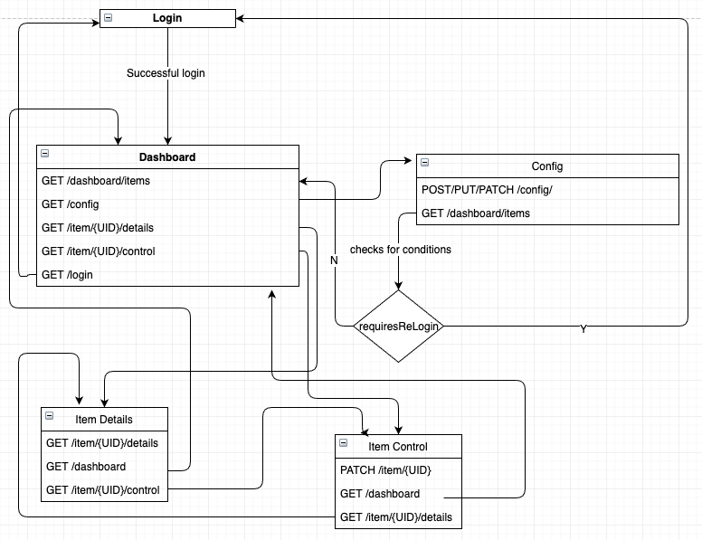

# Requirements:

<ul>
<li> python 3.8
<li> pipenv
</ul>

# How to run mocked server:

Install dependencies:
`pipenv install`

Run mocked server backend with:
`pipenv run python app.py`

Use either postman or curl or any other method to do calls against the server.

# How to run tests:

`pipenv run pytest -s`

<b>Note:</b> Tests don't do proper cleanup. Whenever they need rerunning, the server should also be restarted. This is usually avoided in containerized environments.

# Server description:



## Switches from one state/view to another

```
GET:
/login
/dashboard
/config
/items/{id}/details
/items/{id}/control
```

## login

Returns a randomized "token" every time the correct password is used. The token should then be used in all other calls, or the response will be 401.

```
POST /login
    body:
    {
        username: string,
        password: string
    }
```

## returns a list of items paginated/sorted/filtered
All of these are done under the dashboard view:
```
GET /items
GET /items?page=1
GET /items?page=1&pageSize=50
GET /items?page=1&pageSize=50&sortBy=date
GET /items?page=1&pageSize=50&sortBy=date&sortOrder=asc&filterField=state&filterValue=running
```

## config

Modification done using PUT.
Missing allowed_items overwriting. Missing redirects.
```
POST/PUT/PATCH /config
    {username: xxx,
    password:  yyy,
    allowed_items: []
    }
```

All other view/state change requests besides /dashboard will redirect to either dashboard or login (if user settings changed).

## item details

Changes state on GET. No redirects, this should be done by frontend.

```
GET /items/{id}/details
    returns:
    {
        id: int,
        state: string (running/paused/stopped)
    }
```

## item control

Basic item control. Changes state only when a modification was made.

```
PUT /items/{id}
    {state: string}
```
